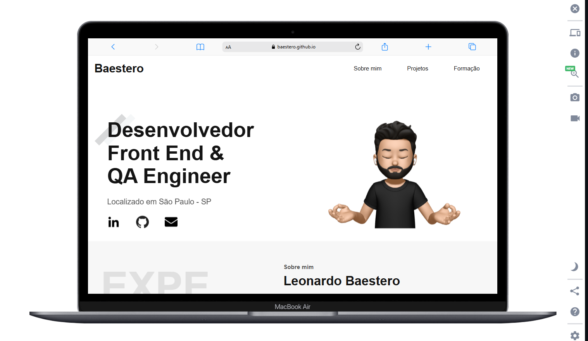

# Portfólio Pessoal de Leonardo Baestero

Este é o meu projeto de portfólio pessoal, onde reúno alguns dos principais projetos que desenvolvi com foco em front-end. O objetivo é demonstrar minhas habilidades com HTML, CSS e JavaScript, desde a construção de interfaces simples até o uso de técnicas mais avançadas.

## 💡 Sobre o Projeto

Neste portfólio você encontrará:

- Projetos simples e funcionais feitos com HTML, CSS e JavaScript.
- Responsividade, adaptando-se bem a diferentes tamanhos de tela.
- Aplicação de técnicas modernas de CSS, como grid, flexbox e pseudo-elementos.
- Animações e interações com JavaScript puro (vanilla JS), sem dependência de frameworks.

## 🔗 Acesse o Portfólio

**Visite o meu portfólio:**
[https://baestero.github.io/porfolio-pessoal/](https://baestero.github.io/porfolio-pessoal/)

## 🖼 Preview

Adicionei abaixo um preview do portfólio para visualização rápida:
**(substitua o link abaixo pela URL da imagem desejada)**



## 🛠 Tecnologias Utilizadas

- HTML5
- CSS3
- JavaScript (Vanilla)

## 🧪 Como Executar Localmente

1. Clone o repositório:

   ```bash
   git clone https://github.com/baestero/porfolio-pessoal.git
   ```

2. Acesse a pasta do projeto:

   ```bash
   cd porfolio-pessoal
   ```

3. Abra o arquivo `index.html` diretamente no navegador.

## 👨‍💻 Autor

Projeto desenvolvido por **Leonardo Baestero**
GitHub: [https://github.com/baestero](https://github.com/baestero)

---
